# Kaggle Study - IJ

@2019.12.08


## 1. 진행 내용

- EDA : historical_transactions.csv
- EDA : new_merchant_transactions.csv


## 2. 진행 세부 내용

1. **Data**

   all_trans_df = pd.merge(all_trans_df, train_df, on=['card_id'], how='left')

   ---

   

2. **first_active_year**

   

   ```python
   all_trans_df.groupby(['first_active_year']).target.mean().plot(kind='bar',
                                                                  alpha=0.75,
                                                                  rot=-90)
   #(X : first_active_year / Y : target_mean)
   ```

   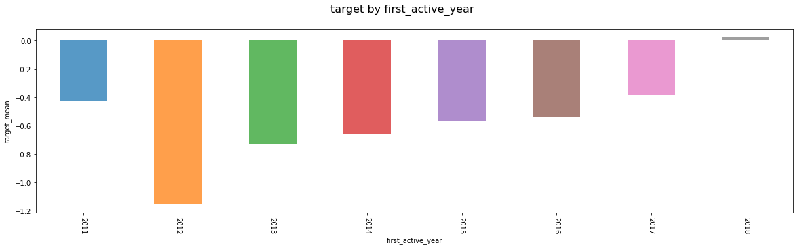

   

   ```python
   all_trans_df.groupby(['first_active_year']).size().plot(kind='bar',
                                                           alpha=0.75,
                                                           rot=-90)
   #(X : first_active_year / Y : size)
   ```

   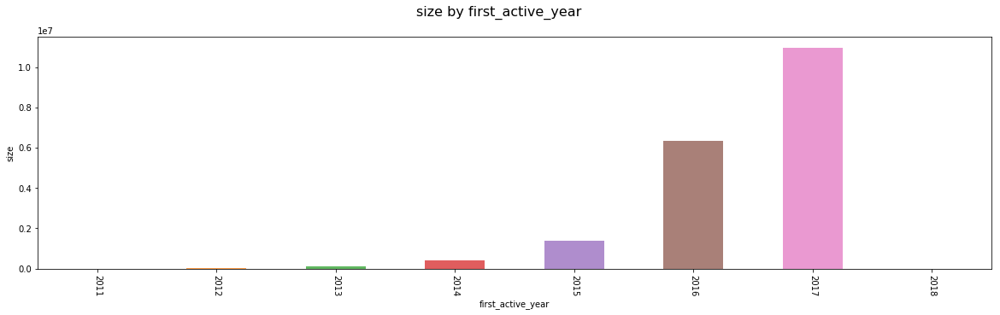

   

   - 데이터 양의 증가에 다른 영향이 다소 있는 것으로 보이나, 2011, 2012, 2018년의 경우 데이터 양이 작음에도 target 평균은 큰 차이를 보임

   ---

   

3. **authorized_flag**


   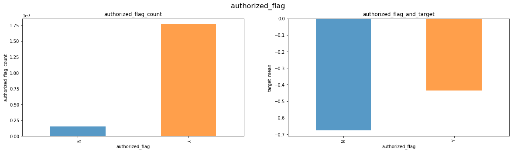

   - authorized_flag의 사이즈는 매우 비대칭적이며, target의 차이가 뚜렷함

   

   ```python
   sns.countplot(x='first_active_year', hue='authorized_flag', data=all_trans_df)
   ```

   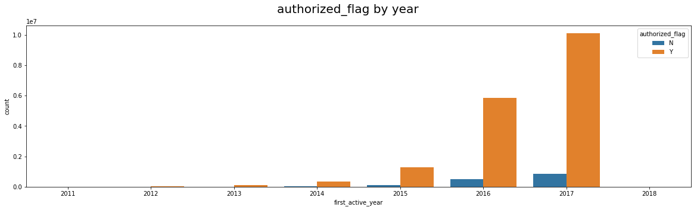

   - authorized_flag의 경우 first_active_year에 따라 Y 비율이 꾸준히 증가함.

   

   ```python
   test_df = all_trans_df.groupby(['first_active_year'])\
   										  .authorized_flag.value_counts().unstack()
   test_df['percentage'] = test_df['Y'] / (test_df['Y']+test_df['N']) * 100
   ```

   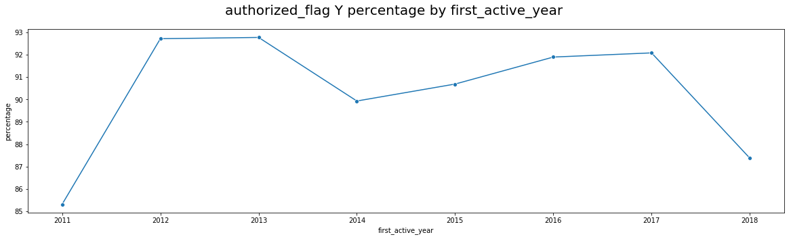

   - 2018년의 경우 급격히 비율이 낮아짐 -> 데이터가 authorized_flag : N 값에 치중되어 있음

   

   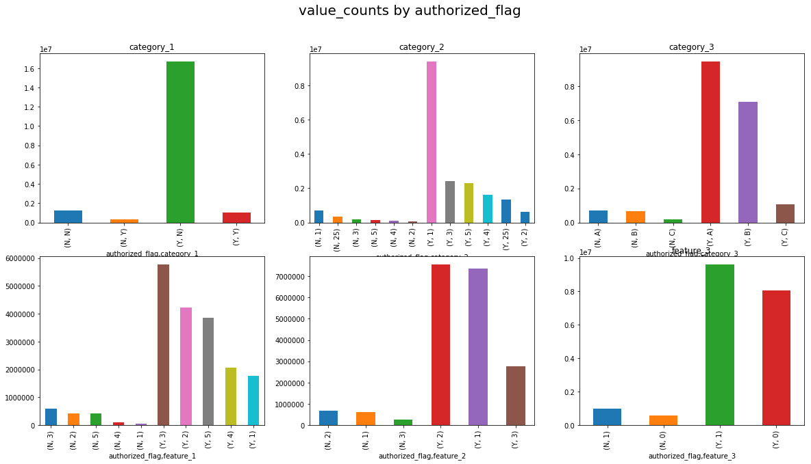

   

   - authorized_flag에 따른 feature_1,2,3과 category_1,2,3의 분포는 비슷해 보임

---

   

4. **purchase_amount**

   

   ```python
   sns.distplot(all_trans_df.purchase_amount, ax=axes[0])
   sns.distplot(np.log1p(all_trans_df.purchase_amount), ax=axes[1])
   ```

   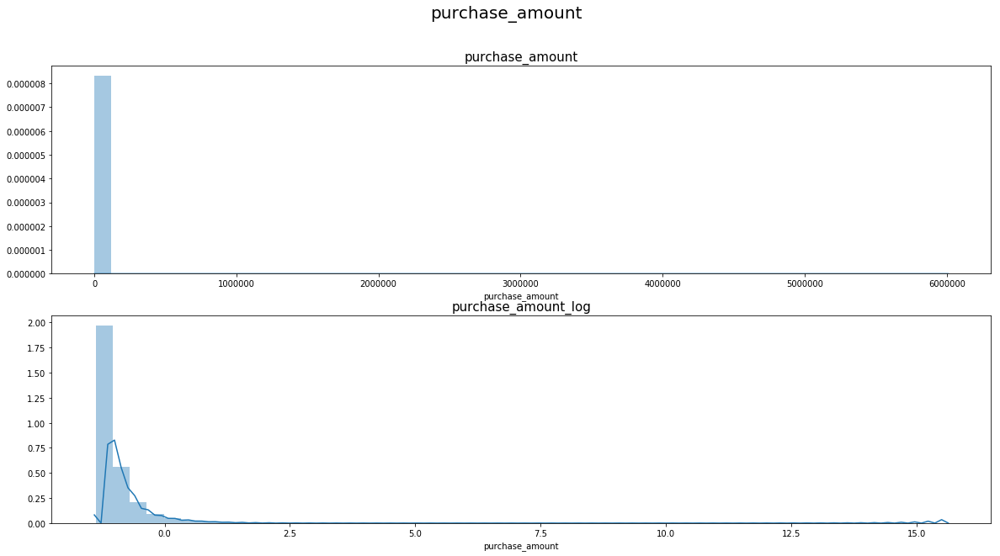

   - purchase_amount의 경우 log변환 후 데이터 분포가 더욱 뚜렷해짐

   

   ```python
   all_trans_df.groupby(['first_active_year']).aggregate({'purchase_amount':'sum'})\
   																					 .plot(kind='bar', ax=axes[0])
   all_trans_df.groupby(['first_active_year']).aggregate({'purchase_amount_log':'sum'})\
   																					 .plot(kind='bar', ax=axes[1])
   ```

   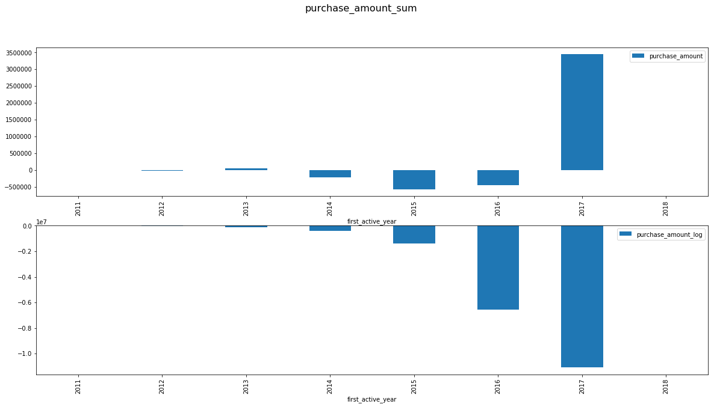

   - first_active_year에 따른 purchase_amount의 sum 값도 log변환 후 뚜렷해짐

   

   ```python
   test_df = all_trans_df.groupby(['card_id'])\
   											.aggregate({'purchase_amount':['mean', 'sum'],
                                     'target':'mean',
                                     'purchase_amount_log': ['mean', 'sum']})
   test_df.columns = ['purchase_amount_log_mean', 'purchase_amount_log_sum',
                      'target',
                      'purchase_amount_mean', 'purchase_amount_sum']
   test_df['purchase_amount_sum_log'] = np.log1p(test_df['purchase_amount_sum'])
   test_df['purchase_amount_mean_log'] = np.log1p(test_df['purchase_amount_mean'])
   idx = test_df.purchase_amount_sum < 600000
   ```

   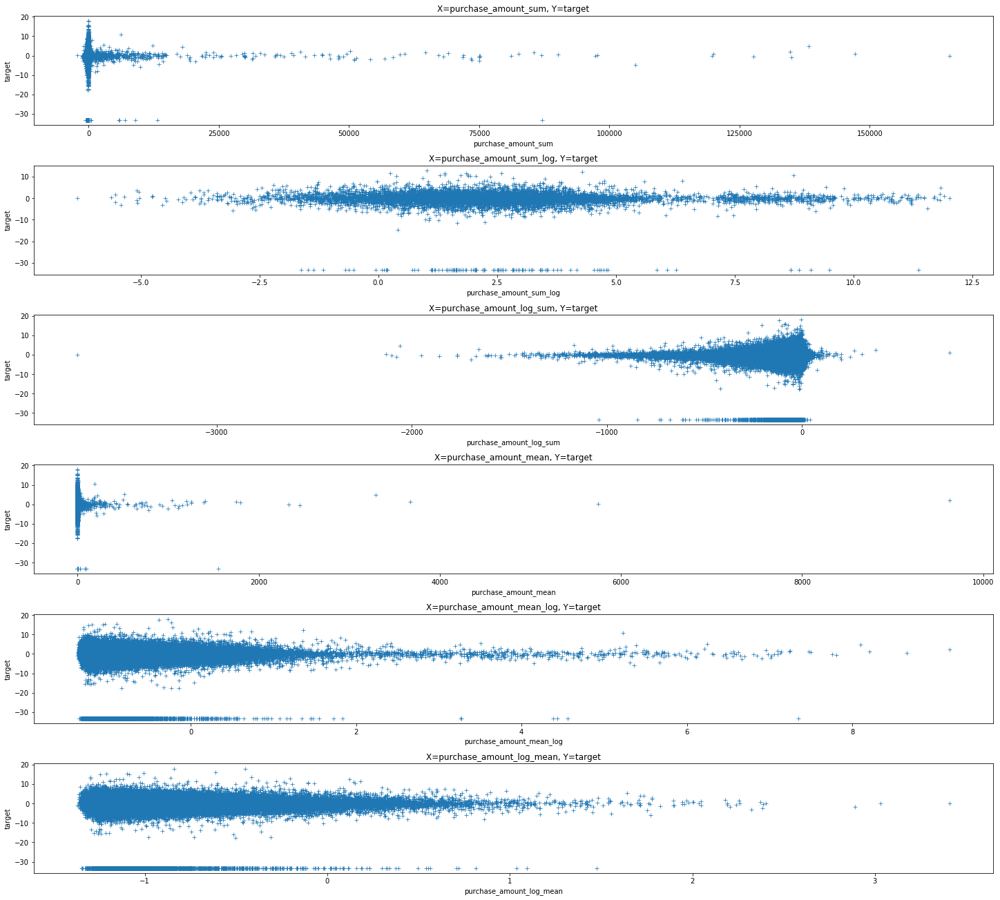

   - purchase_amount의 sum 보다는 [ sum->log or log->sum ] 의 사용이 좋아 보임

   ---

   

5. **purchase_interval**

   ```python
   all_trans_df.purchase_date = pd.to_datetime(all_trans_df.purchase_date,
                                               format='%Y-%m-%d %H:%M:%S')
   all_trans_df.first_active_month = pd.to_datetime(all_trans_df.first_active_month, 
                                                    format='%Y-%m')
   all_trans_df['purchase_interval'] = all_trans_df.purchase_date - all_trans_df.first_active_month 
   all_trans_df['purchase_interval'] = all_trans_df.purchase_interval.apply(lambda x: x.days)
   ```

   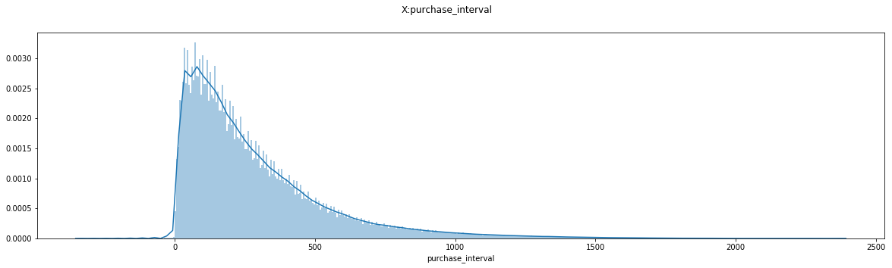

   ```python
   #target ~ purchase_date - first_active
   test_df = all_trans_df.groupby(['card_id'])\
   											.aggregate({'purchase_interval': ['mean', 'sum'],
                                     'target': 'mean'})
   test_df.columns = ['target', 'purchase_interval_mean', 'purchase_interval_sum']
   ```

   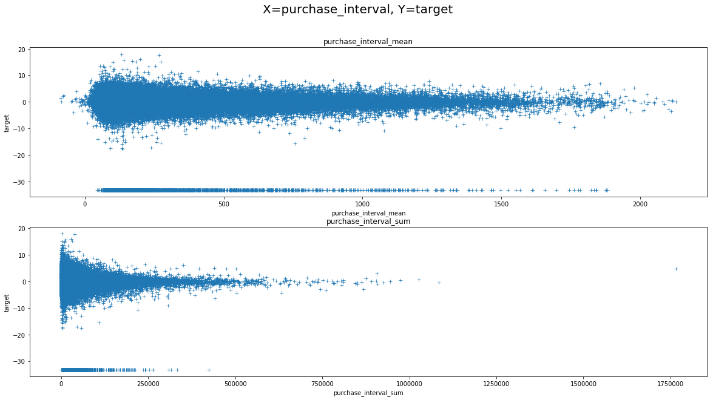

6. **month_lag**

   ```python
   test_df = all_trans_df.groupby(['month_lag']).aggregate({'target':'mean'}).reset_index()
   ```

   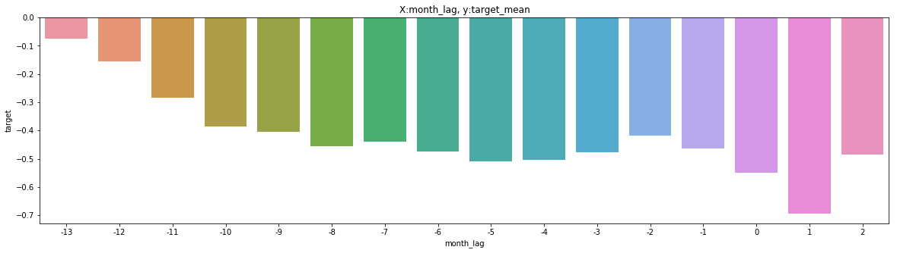

   - month_lag ~ target : 음의 상관관계

   ---

   

7. **Category features**

   ```python
   all_trans_df.groupby(['category_1']).target.mean().plot(kind='bar',alpha=0.75, rot=-90, ax=axes[0])
   all_trans_df.groupby(['category_2']).target.mean().plot(kind='bar',alpha=0.75, rot=-90, ax=axes[1])
   all_trans_df.groupby(['category_3']).target.mean().plot(kind='bar',alpha=0.75, rot=-90, ax=axes[2])
   ```

   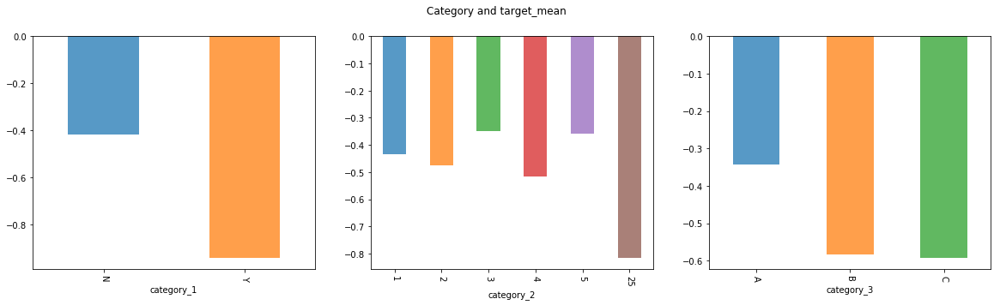

   - category에 따라 어느정도 target의 차이가 뚜렷함

   

   ```python
   sns.countplot(x='first_active_year', hue='category_1', data=all_trans_df, ax=axes[0])
   sns.countplot(x='first_active_year', hue='category_2', data=all_trans_df, ax=axes[1])
   sns.countplot(x='first_active_year', hue='category_3', data=all_trans_df, ax=axes[2])
   ```

   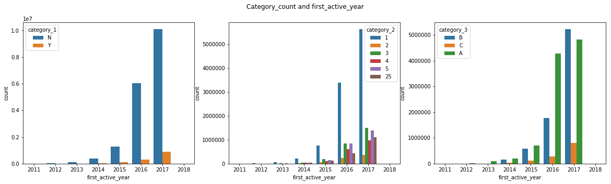

   - 비슷한 비율로 매년 증가
   - category_3의 경우 2017년에 B 값이 매우 크게 증가하였음

   

   ```python
   test_df = all_trans_df.groupby(['card_id'])\
   											.aggregate({'category_1_label': ['sum', 'mean'],
                                     'category_2_label': ['sum', 'mean'],
                                     'category_3_label': ['sum', 'mean'],
                                     'target':'mean'})
   ```

   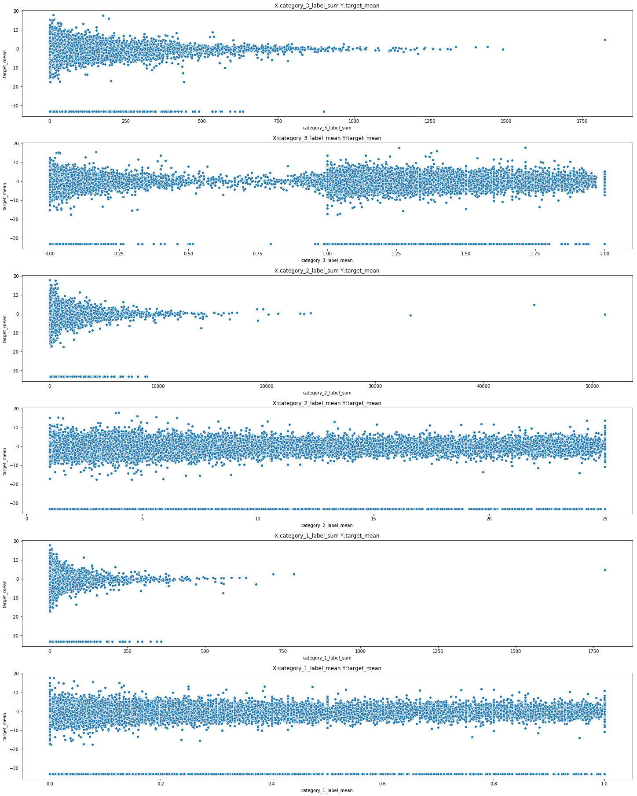

   - category값의 mean보다 sum에 따른 target의 분포가 명확해보임

   ---

   

8. **Installments**

   ```python
   sns.countplot(x='installments', data=all_trans_df, ax=axes[0])
   all_trans_df.groupby(['installments']).purchase_amount.mean()\
   																			.plot(kind='bar', alpha=0.75, ax=axes[1])
   all_trans_df.groupby(['installments']).target.mean()\
   																			.plot(kind='bar', alpha=0.75, ax=axes[2])
   ```

   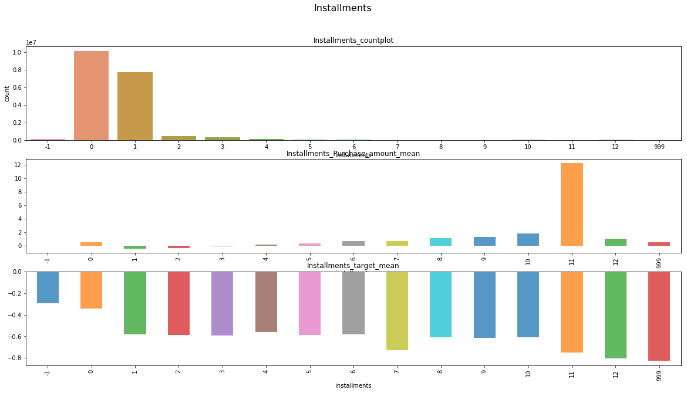

   - Installments의 count는 명확히 구분됨

   - Installments에 따른 purchase_amount mean은 양의 상관관계를 보임

   - Installments에 따른 target mean은 음의 상관관계를 보임

     

   ```python
   test_df = all_trans_df.groupby(['card_id']).aggregate({'installments': 'mean'})
   sns.distplot(test_df.installments, bins=500)
   ```

   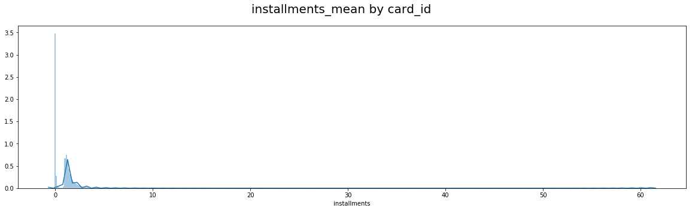

   - card_id에 따른 installments mean은 어느정도의 정규분포를 따름

     

   ```python
   test_df = all_trans_df.groupby(['card_id'])\
   											.aggregate({'installments':'mean', 'target':'mean'})
   sns.scatterplot(x='installments', y='target', data=test_df)
   ```

   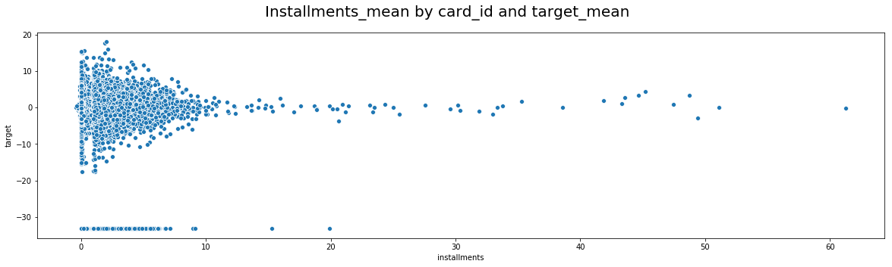

   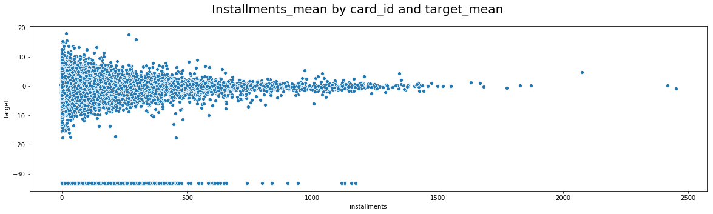

   - card_id에 따른 installments와 target의 mean, sum은 깊은 관계가 있어보임

     

   ```python
   print('[*]category_3 (installments == -1) : {}'.format(all_trans_df.query('installments == -1')['category_3'].unique()))
   print('[*]installments (category_3 == null) : {}'.format(all_trans_df[all_trans_df['category_3'].isnull()]['installments'].unique()))
   
   #[cetogory_3 == None] <-> [installments == -1]
   #catogory_3(None) and installments(-1) -> cancle purchase
   ```

   - installments == -1 일 때, category_3은 모두 nan 값.
   - category_3 == Null 일 때, installments는 모두 -1.

   ---

   

9. **city_id**

   ```python
   all_trans_df.groupby(['city_id']).size().plot(kind='bar')
   ```

   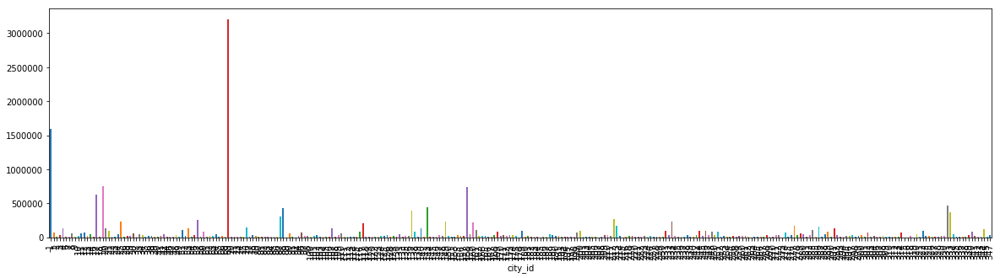

   - city_id 는 불규칙한 size를 가짐.

     

   ```python
   test_df = all_trans_df.groupby(['city_id']).target.mean()\
   											.reset_index().sort_values(by=['target'])
   sns.barplot(x='city_id', y='target', data=test_df, order=test_df.city_id)
   ```

   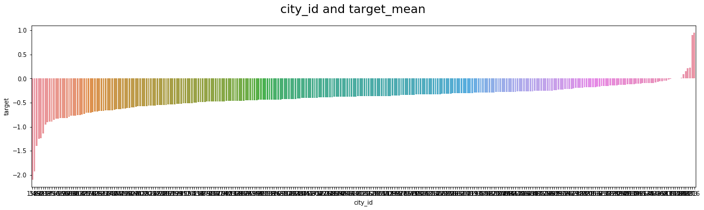

   - city_id에 따라 target mean의 차이는 명확함
   - target_encoding 등 적절한 encoding 필요함

   ```python
   test_df = all_trans_df.groupby(['city_id']).size().reset_index()
   test_df.columns = ['city_id', 'city_id_cnt']
   test_df_2 = all_trans_df.groupby(['city_id']).target.mean().reset_index()
   test_df = pd.merge(test_df, test_df_2, on=['city_id'], how='left')
   sns.scatterplot(x='city_id_cnt', y='target', data=test_df)
   ```

   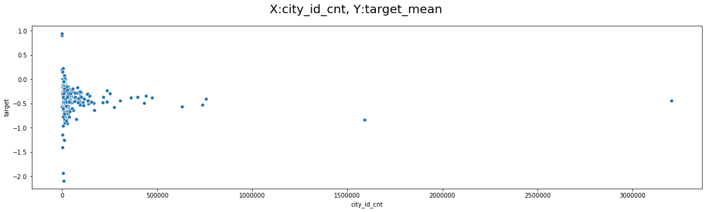

   - city_id의 size와 target mean값은 다른 feature 들과 비슷한 분포의 그래프를 보임

   ---

   

10. **merchant_id**

   ```python
   all_trans_df.groupby(['merchant_category_id']).size().plot(kind='bar')
   ```

   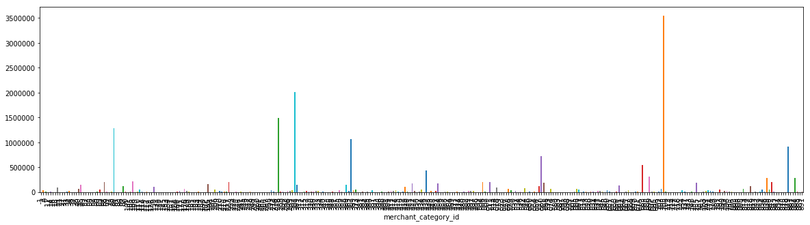

   - merchand_id 는 불규칙한 size를 가짐

     

   ```python
   test_df = all_trans_df.groupby(['merchant_category_id']).target\
   											.mean().reset_index().sort_values(by=['target'])
   sns.barplot(x='merchant_category_id', y='target',
               data=test_df, order=test_df.merchant_category_id)
   ```

   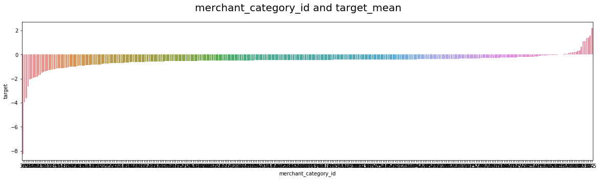

   - merchant_id 따라 target mean의 차이는 명확함
   -  적절한 encoding 필요함

   

   ```python
   test_df = all_trans_df.groupby(['merchant_category_id']).size().reset_index()
   test_df.columns = ['merchant_category_id', 'merchant_category_id_cnt']
   test_df_2 = all_trans_df.groupby(['merchant_category_id'])\
   												.target.mean().reset_index()
   test_df = pd.merge(test_df, test_df_2, on=['merchant_category_id'], how='left')
   sns.scatterplot(x='merchant_category_id_cnt', y='target', data=test_df)
   ```

   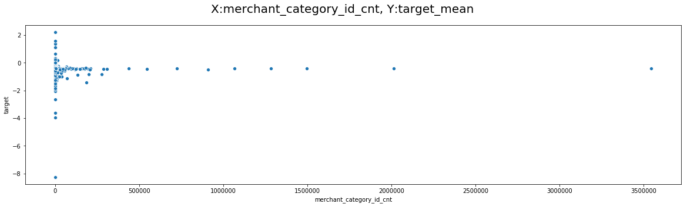

   ---

   

11. **subsector_id**

    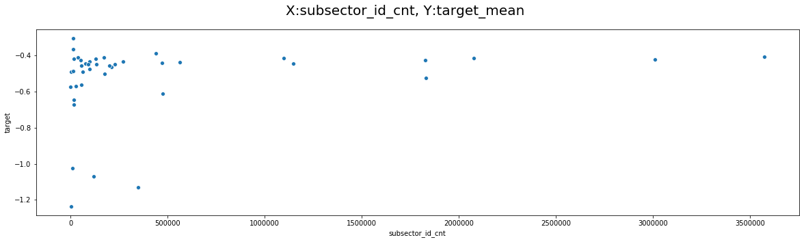

    - city_id, merchant_id와는 달리 불균형한 분포를 보임